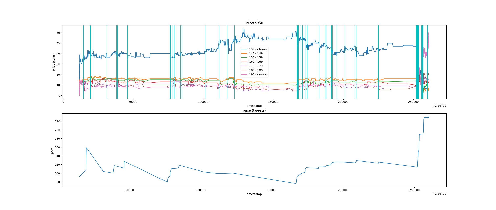
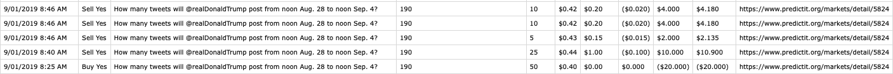
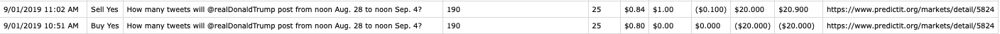

#### Centipede

What this project contains:

- tweetbot for DJT tweet markets 
- naive market maker (just tried to buy/sell contracts if a spread >= 3 existed)
- negarb markets (not quite correct)

#### Project structure

```
doc/     - various documentation related to strategies or assets for this readme
lib/     - predictit / twitter apis created for this project
tools/   - tools for saving and analyzing predictit data
trading/ - implementation of trading strategies
```

#### Strategies

The [market maker](https://github.com/capricorn/centipede/blob/master/trading/arbbot.py) 
simply tried to buy/sell a fixed number of shares if a contract
had a spread >= 3. 

The [negarb script](https://github.com/capricorn/centipede/blob/master/trading/negbot.py) 
looked for 'negative arbitrage' opportunities,
perfect hedges that guaranteed a profit. That script only checked the
entire market itself, rather than subsets of that market.

How to find neg arb markets, where C represents all contracts in the market:


However, the focus was on the [tweet market bot](https://github.com/capricorn/centipede/blob/master/trading/tweetbuy.py).
The following inspired the strategy:

A tweet market (now unavailable) on PredictIt was a market where you could bet
on the number of tweets an account would make in a week period.
These accounts were typically presidential, such as @WhiteHouse.
There was typically a bottom bracket and top bracket, which covered
all numbers beneath, and all numbers above. The in-between brackets would
each differ by 10 tweets or so. For example, you could have:

```
Tweet count
<90
90-99
100-109
110-119
>119
```

Of course, only a single bracket would resolve as correct at the end of the week.
The tweet markets were particularly alluring because of their high volatility.
Here is the graph that somewhat inspired this idea. It was generated by 
[tpcorr.py](). (*Warning, this script is messy!*)



The top graph shows the price data of each bracket over
the course of the market. The vertical lines are when tweets
occurred from DJT. The bottom shows the projected average tweet
count by the end of the week.

The basic idea was that tweets typically occurred in clusters,
usually within a small time window. Once a bracket was close
to being disqualified, its price would rapidly decline, and the
money would transfer to the higher brackets. With this knowledge,
the thought was that purchasing a higher bracket which was
expected to rise the instant a tweet occurred would allow for a quick
5c or so gain on the bracket, which could then be dumped for a small profit.

An important part of the strategy was to allow a reasonable time between tweet
clusters. For example, don't execute the strategy unless 2 hours have passed
since that last tweet. This allowed the market to 'settle', and result in a greater
pump upon tweeting. Of course, if only a single tweet occurred, usually the position
would have to be dumped for a small loss, whatever the spread was.

Here are two instances where things worked out, with a small number of
contracts. The 4th column is the contract id, and the 5th and 6th quantity
and price of purchase, respectively. The 7th column represents the profit
realized from that transaction.





#### Performance

Given that this strategy was reliant on speed, I had a script that checked for
new tweets from the twitter account whose market I was interested in. In hindsight,
a webhook using the twitter api would've been better. Colocation was also a thought,
but the strategy never quite panned out for that to be necessary.

#### Issues

- Liquidity issues
- When the strategy should actually start (how many days in to the market)
- Selecting a bracket (automation problem)
- How long to hold the position (automation problem)
- Bannable

#### Result

